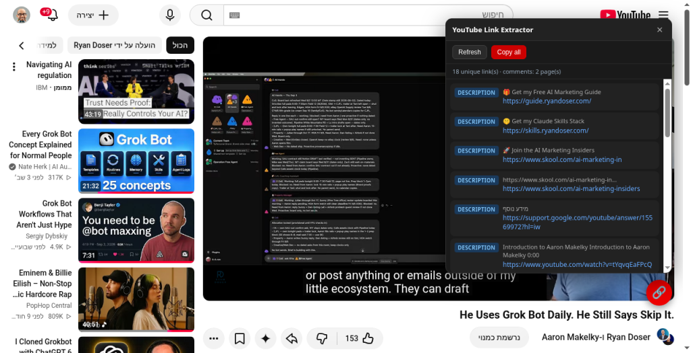
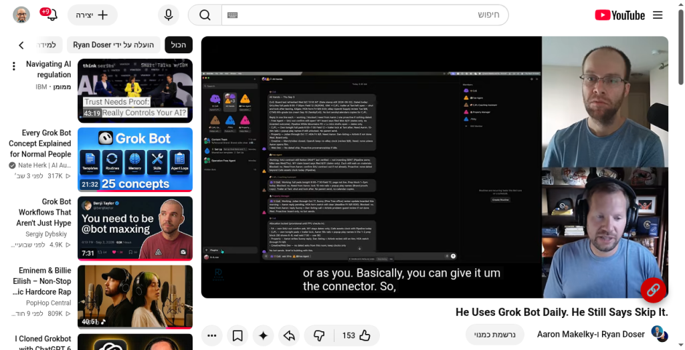
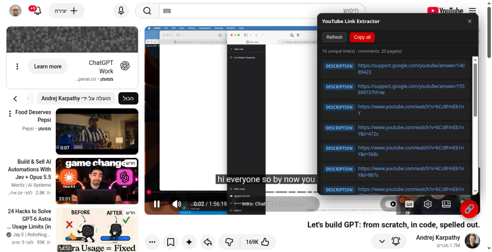

# YouTube Link Extractor

Chrome / Chromium / Edge **Manifest V3** extension that pulls every unique HTTP(S) link out of a YouTube watch page — from the **video description** and **comments** (including deep / lazy-loaded threads via the Innertube API, no scroll simulation).

Click the red 🔗 floating button on any `youtube.com/watch*` page to open a popover of deduplicated links. Optional **per-link labels** (text that sat next to the URL) appear when available, and **Copy all** puts them on your clipboard.



*Popover listing unique links with source badges and optional description labels.*

## Features

- Extracts links from the video **description** and **comments**
- Walks comment continuations via the YouTube **Innertube API** (capped at 20 pages) — no scroll simulation
- **Deduplicates** with light URL normalization (host case, default ports, trailing slash, common `utm_*` / `si` params)
- Source badge per link: `description` or `comment`
- **Optional per-link descriptions** — useful same-line labels shown in the popover and included in **Copy all** as `label — url`
- **Copy all** / **Refresh** / open any link in a new tab
- Host permissions for YouTube only — no `storage`, `tabs`, or `<all_urls>`

## Screenshots

| Watch page (FAB) | Popover (with labels) | Popover (links list) |
| --- | --- | --- |
|  |  |  |

## Load unpacked (Chrome / Chromium / Edge)

1. Clone or download this repository to a folder on your machine.
2. Open `chrome://extensions` (or `edge://extensions`).
3. Enable **Developer mode** (top-right).
4. Click **Load unpacked** and select the project root (the folder that contains `manifest.json`).
5. Open any YouTube watch page (`https://www.youtube.com/watch?v=…`).
6. Click the red 🔗 button (bottom-right of the player) to open the popover.

## Permissions

Host permissions only:

- `https://www.youtube.com/*`
- `https://youtube.com/*`

No `storage`, `tabs`, or broad `<all_urls>` permissions.

## Development / tests

Pure extract / dedupe helpers live in `src/lib/extractLinks.js` and run under Vitest without Chrome:

```bash
npm install
npm test
```

## Layout

```
manifest.json
src/content.js              # floating button + popover
src/ui.css
src/lib/extractLinks.js     # extract, normalize, dedupe, optional labels
src/lib/youtubeComments.js  # Innertube continuations
icons/
docs/                       # README screenshots
tests/extractLinks.test.js
package.json
```

## Notes

- Comments use the page’s `INNERTUBE_API_KEY`, client version, and visitor data from `ytcfg` / embedded JSON, then `/youtubei/v1/next` continuations.
- Description text comes from the DOM (`#description`, expanded expander) and from `ytInitialPlayerResponse` / `ytInitialData` when present.
- Comment pagination is capped at **20** Innertube pages (`MAX_COMMENT_PAGES` / `DEFAULT_MAX_PAGES`).
